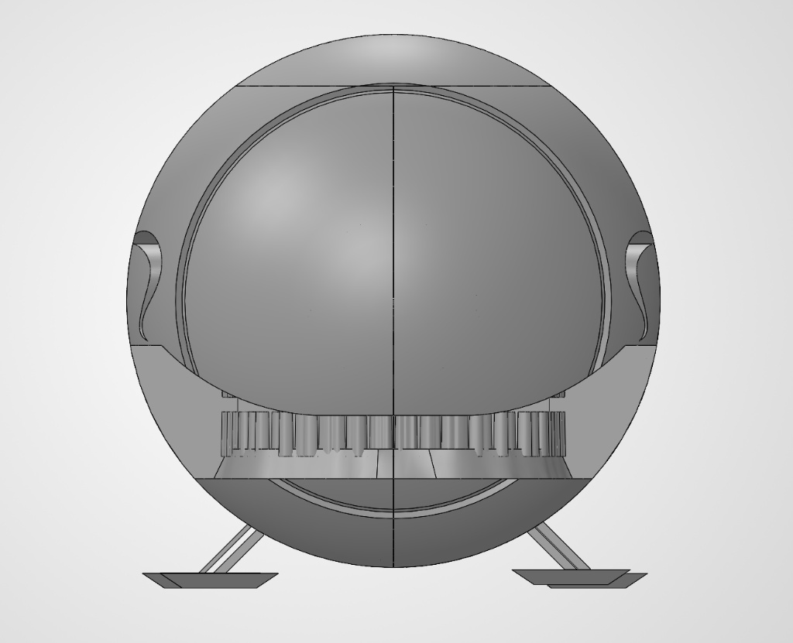
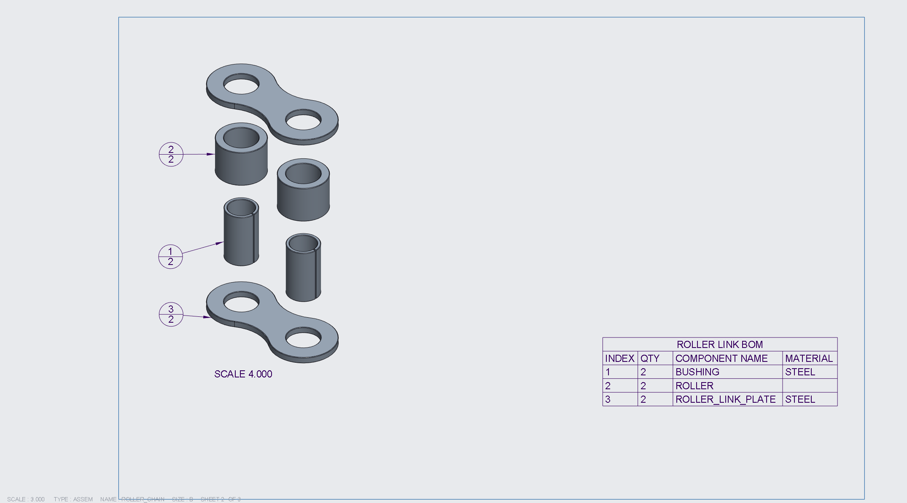
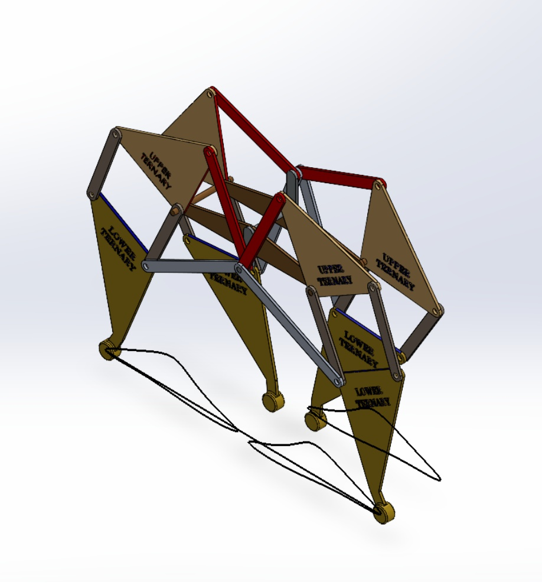
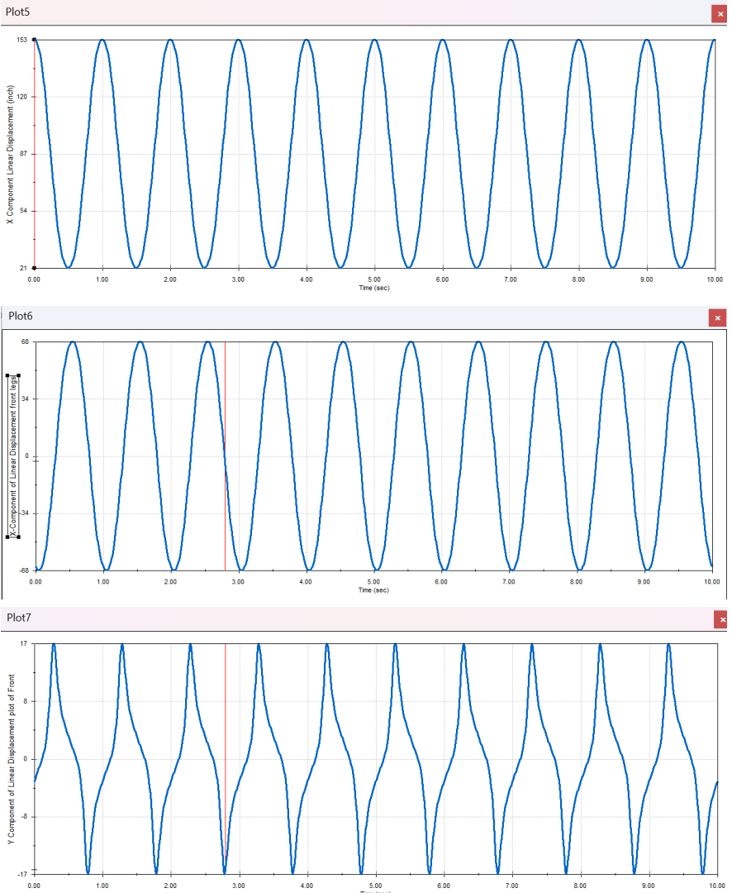
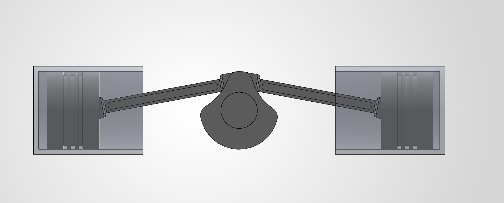
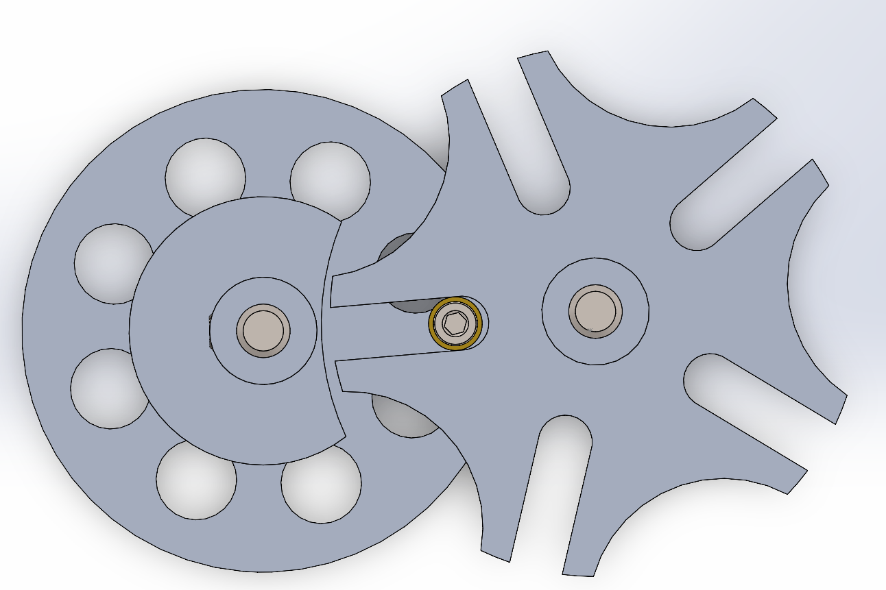
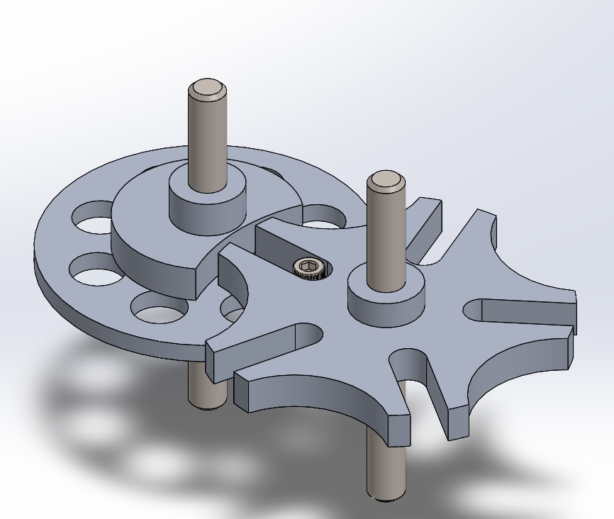
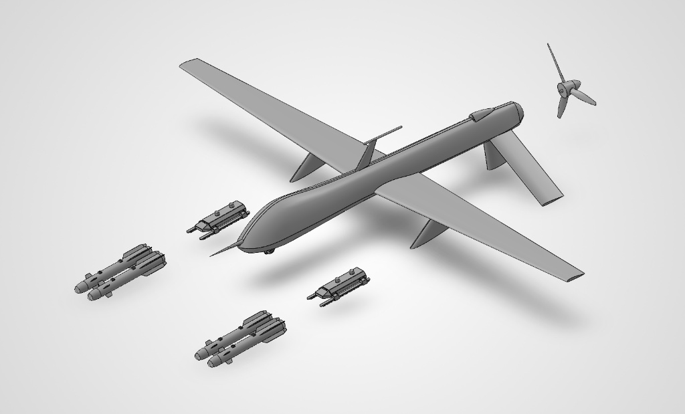

# 3D CAD パラメトリックモデル & 機構設計ポートフォリオ

SolidWorks および PTC Creo で作成された機械CADモデル、複雑なサブアセンブリ、運動解析、産業用工具、高度なサーフェスデザイン、ならびにパラメトリック・ハードウェアを収録した総合エンジニアリングポートフォリオです。

---

## 技術概要

* **使用CADシステム:** SolidWorks, PTC Creo
* **コアコンピテンシー（主要スキル）:**
  * 高度なサーフェスモデリング & スイープガイドカーブ設計
  * ボトムアップ & トップダウン方式による機械アセンブリモデリング
  * 機構シミュレーション & 運動解析（変位・速度・加速度）
  * 製造・組立性を考慮した設計（DFMA） & アディティブ・マニュファクチャリング設計（DfAM）
  * 生産図面作成、幾何公差（GD&T）、詳細図 & 部品表（BOM）の作成

---

## 主要フラグシッププロジェクト

### 1. オーガニックシェル筐体 (SolidWorks)
複雑な曲面外形、スイープガイドカーブ、内部スナップフィット構造、高精度アライメントタブ、上部パネルのカスタムローレット加工、マルチパーツアセンブリ公差を再現した高度な自由曲面サーフェスプロジェクトです。

| 等角図 (Iso) | 正面図 | 右側面図 | 下面図 | 背面図 | 上面図 |
| :---: | :---: | :---: | :---: | :---: | :---: |
|  |  |  |  |  |  |

| 分解図 01 | 分解図 02 |
| :---: | :---: |
|  |  |

---

### 2. ローラーチェーンアセンブリ & 製造図面 (PTC Creo)
サブアセンブリ（`ROLLER_CHAIN`, `PIN_LINK`）、拘束アセンブリ、分解構成、部品表（BOM）付き完全製造図面を含む、Creoで作成された多部品動力伝達アセンブリです。

| 正面図 | 側面図 | 等角図 | アセンブリ製造図面 | ピンリンク図面 | ローラーリンク図面 |
| :---: | :---: | :---: | :---: | :---: | :---: |
|  |  |  |  |  |  |

---

### 3. クランリンク歩行機構 (SolidWorks)
運動シミュレーション、軌跡描画、変位プロット、運動学的な速度・加速度解析を備えた多足歩行リンク機構です。

| 軌跡描画図 | 運動解析グラフ |
| :---: | :---: |
|  |  |

---

## 運動機構 & 複雑アセンブリ

### 4気筒クランクシャフトアセンブリ (SolidWorks)
| 等角図 | 正面図 | 上面図 |
| :---: | :---: | :---: |
|  |  |  |

---

### ジェネバ機構 - 間欠駆動 (SolidWorks)
| 等角図 | 分解アセンブリ | 上面図 | 下面図 | 斜め上面図 |
| :---: | :---: | :---: | :---: | :---: |
|  |  |  |  |  |

---

### 航空機格納式ランディングギア (SolidWorks)
| レンダリング等角図 | 等角図 | 正面図 | 側面図 |
| :---: | :---: | :---: | :---: |
|  |  |  |  |

---

### プレデタードローン無人航空機 (SolidWorks)
| 斜め前面図 | 斜め背面図 | 分解図 | 正面図 | 側面図 |
| :---: | :---: | :---: | :---: | :---: |
|  |  |  |  |  |

---

### 自動車ホイール & トレッドアセンブリ (SolidWorks)
| 等角図 | 分解図 | トレッド詳細 | 斜め前面図 | 斜め背面図 |
| :---: | :---: | :---: | :---: | :---: |
|  |  |  |  |  |
